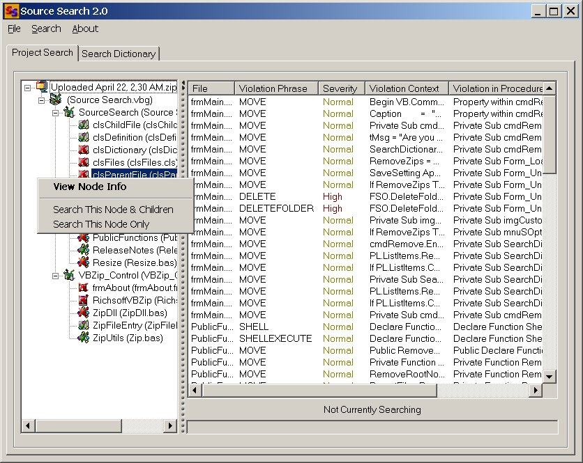



## Source Search 2\.0

### Description

The executable files keep getting stripped out of this file. Until we get that fixed, you can download a full zip of Source Search at:

http://sourcesearch2.homestead.com/

Happy Searching!

I've added ZIP capability to Source Search. Now you can just drag and drop any ZIP file into it and magically the file is unzipped and the VB files are scanned. There are also some new popup menus for the project list. 

----

Ever worry that the code that you are downloading is malicious? Verify the code before you run it, with Source Search. Just drag an drop your project file onto the form and let Source Search check out the code against a customizable search dictionary. It will also enumerate through your project file to make sure that all referenced components are scanned. I have included a basic dictionary with the project. If anyone can find other terms to add to the dictionary, email me at goodhewc@hotmail.com and I will add your suggestion to the dictionary. Also, send me an email at the same address if you would like to receive dictionary updates by email. Please leave feedback and vote!
 
### More Info
 

             |
---                |---
**Submitted On**   |2001-04-22 02:56:12
**By**             |[Minnow](https://github.com/Planet-Source-Code/PSCIndex/blob/master/ByAuthor/minnow.md)
**Level**          |Beginner
**User Rating**    |4.7 (606 globes from 128 users)
**Compatibility**  |VB 6\.0
**Category**       |[Complete Applications](https://github.com/Planet-Source-Code/PSCIndex/blob/master/ByCategory/complete-applications__1-27.md)
**World**          |[Visual Basic](https://github.com/Planet-Source-Code/PSCIndex/blob/master/ByWorld/visual-basic.md)
**Archive File**   |[Source Sea20778672001\.zip](https://github.com/Planet-Source-Code/minnow-source-search-2-0__1-22222/archive/master.zip)

